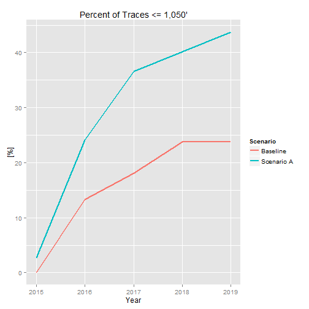

Reservoir Conditions
========================================================
author: Alan Butler
date: December 20, 2014

Background
========================================================

In water resources management, and likely in other applications, simulation models can be used to quantify the chances that some future event may happen based on a number of different assumptions. 

In this "what-if" type of approach, hundreds or thousands of simulations, i.e., traces, may be performed before changing the assumptions on one or more of the inputs; this creates multiple **scenarios**. Then, many more simulations are completed, and the results can be compare accross scenarios. 

This particular example presents several dynamic figures aimed at understanding the risks that water supply reservoirs will reach different elevations.

Problem
========================================================
When analyzing many scenarios, it is impossible to predict what information is important or interesting to different audiences. While typical plots are adequate for presentations, those that want to truely understand the data need to be able to explore it, interactively, on their own. 

Instead of having to request simple changes, e.g., what is the risk of reaching elevation _X_ instead of elevation _Y_, from the data owner, and then having the data owner re-run code with a new threshold, the Shiny app, allows the user to modify this information in an interactive setting. 

Code to Compute Risks
========================================================
The following code computes the risks of reaching a certain elevation for a particular reservoir. The Shiny app utilizes similar code with interactive selection of the different data dimensions.


```r
thresh <- 1050 # select the elevation threshold
res <- 'Bronco' # select the reservoir
month <- 'Dec'
X <- X[X$Reservoir %in% res & X$Month == month,]  
X$Thresh <- thresh
# calculate the percent of traces below the threshold
X <- ddply(X,.(Scenario,Trace,Year,Reservoir),summarize, vv = Value <= Thresh)
X <- ddply(X,.(Scenario,Year,Reservoir),summarize,Value = mean(vv) * 100)
```

Risk of Reaching Elevation Figure
========================================================

 

***

- This figure is dynamically updated in the Shiny app for different reservoirs or different thresholds.
- The Shiny app is a demonstration of some of the types of computations that can be made interactive to reduce the number of requests for "different" information.
